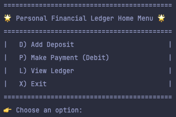
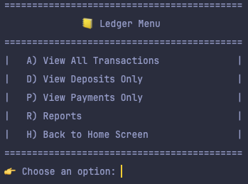
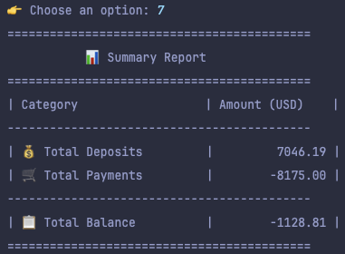

# 💼 Personal Finance Ledger

A Java-based CLI application that helps users track deposits, payments, and generate financial reports. Built as a capstone project to practice file I/O, loops, conditionals, and real-world logic in Java.

## ✨ Features

- 📥 Add Deposits
- 💸 Make Payments (Debits)
- 📒 View Ledger (All, Deposits, or Payments)
- 📊 Reports:
  - Month to Date
  - Previous Month
  - Year to Date
  - Previous Year
  - Search by Vendor
  - 🔍 Custom Search (start date, end date, description, vendor, amount)
  - 📋 Summary Report (total deposits, payments, net balance)
- ✅ Input validation and error handling
- 📁 All transactions saved to `transactions.csv`

## 🖼️ Screenshots

### 🏠 Home Menu
Main menu with options to add deposits, make payments, view ledger, or generate reports.

---

### 📒 Ledger Menu
Filter transactions or navigate to the reports section.

---

### 📈 Reports Menu
Options to generate reports by date, vendor, or run a summary.

---

### 🔍 Custom Search
Search transactions using any combination of start date, end date, description, vendor, or amount.

---

### 📊 Summary Report
Displays total deposits, total payments, and net balance in a clean summary format.

