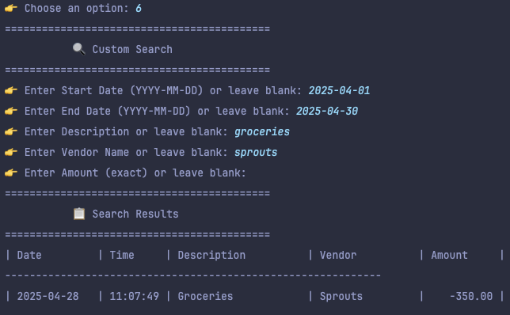

# 💼 Personal Finance Ledger

A Java-based CLI application that helps users track deposits, payments, and generate financial reports. Built as a capstone project to practice file I/O, loops, conditionals, and real-world logic in Java.

## ✨ Features

- 📥 Add Deposits
- 💸 Make Payments (Debits)
- 📒 View Ledger (All, Deposits, or Payments)
- 📊 Reports:
  - Month to Date
  - Previous Month
  - Year to Date
  - Previous Year
  - Search by Vendor
  - 🔍 Custom Search (start date, end date, description, vendor, amount)
  - 📋 Summary Report (total deposits, payments, net balance)
- ✅ Input validation and error handling
- 📁 All transactions saved to `transactions.csv`

## 🖼️ Screenshots

### 🏠 Home Menu
Main menu with options to add deposits, make payments, view ledger, or generate reports.


---

### 📒 Ledger Menu
Filter transactions or navigate to the reports section.


---

### 📈 Reports Menu
Options to generate reports by date, vendor, or run a summary.


---

### 🔍 Custom Search
Search transactions using any combination of start date, end date, description, vendor, or amount.



---

### 📊 Summary Report
Displays total deposits, total payments, and net balance in a clean summary format.


## ✨ Interesting Code Snippet: Flexible Custom Search

This feature allows users to filter transactions using any combination of search fields: date range, description, vendor name, and amount. Each field is optional, and invalid inputs (like wrong date format or non-numeric amounts) are handled efficiently. This makes the app more user-friendly, safer, and smarter.

```java
// Prompt the user to enter amount
System.out.print("👉 Enter Amount (exact) or leave blank: ");
String amountInput = scanner.nextLine().trim();
Double amount = null;
if (!amountInput.isEmpty()) {
    try {
        amount = Double.parseDouble(amountInput);
    } catch (NumberFormatException e) {
        System.out.println("❌ Invalid amount format. Please enter a valid number.");
        return;
    }
}

// Loop from newest to oldest
for (int i = transactions.size() - 1; i >= 0; i--) {
    LedgerTransaction t = transactions.get(i);
    LocalDate transactionDate = LocalDate.parse(t.getDate());

    boolean matches = true;

    if (startDate != null && transactionDate.isBefore(startDate)) matches = false;
    if (endDate != null && transactionDate.isAfter(endDate)) matches = false;
    if (!description.isEmpty() && !t.getDescription().toLowerCase().contains(description)) matches = false;
    if (!vendorName.isEmpty() && !t.getVendor().toLowerCase().contains(vendorName)) matches = false;
    if (amount != null && t.getAmount() != amount) matches = false;

    if (matches) {
        System.out.printf("| %-12s | %-8s | %-20s | %-15s | %10.2f |\n",
                t.getDate(), t.getTime(), t.getDescription(), t.getVendor(), t.getAmount());
        System.out.println("-----------------------------------");
    }
}
```

## 💡 Why it's Interesting
- ✅ Supports multiple optional filters
- 🔒 Validates user input to prevent crashes
- 📅 Lets users search by date, description, vendor, or amount
- 🔁 Displays results in reverse chronological order
- 📊 Provides real-world usability similar to finance apps

